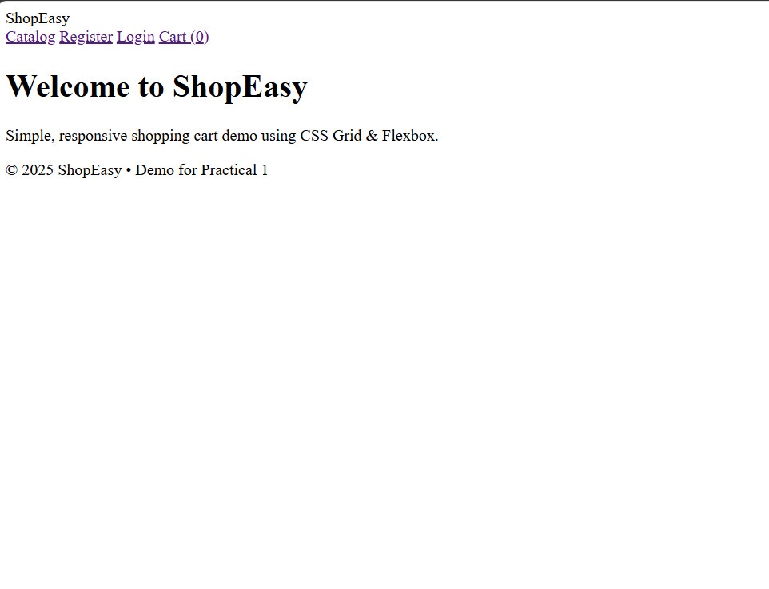
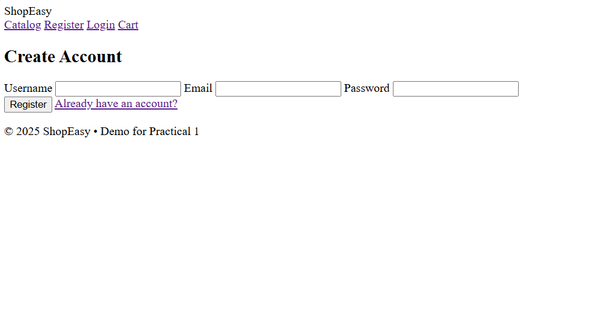
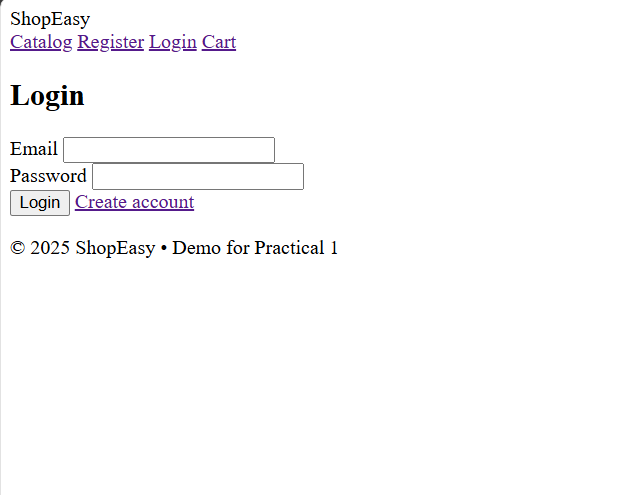
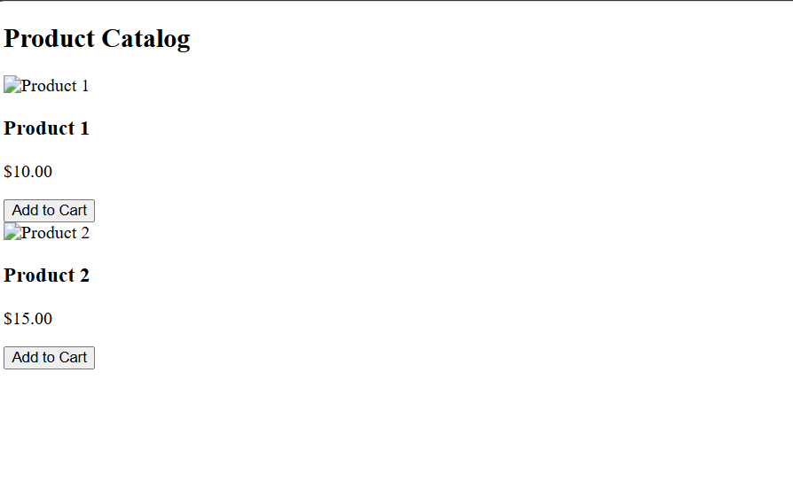
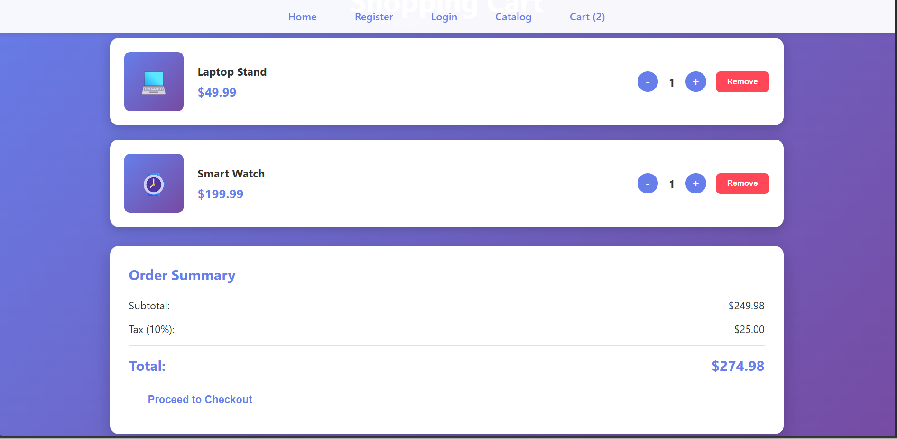

### Experiment 1 - Responsive Shopping Cart Application Using CSS3, Flexbox, and Grid

---

Develop a shopping cart web application using  HTML5 and CSS3 . This practical introduces students to  CSS3 properties, flexbox, and grid layouts .

### Steps:

1. Create a new folder named ShopEasy and navigate into it to set up your shopping cart application.
2. Create a main entry page:  `index.html` . This page should provide navigation links to  registration, login, catalog, and cart pages .



3. Create the Registration page (`register.html`) with a simple form for:
   * Username
   * Email
   * Password



4. Create the Login page (`login.html`) with a form for:
   * Email
   * Password



5. Create the Catalog page (`catalog.html`) displaying products in a grid layout using  CSS grid .



6. Create the Cart page (`cart.html`) to display selected items using  flexbox .


7. Create an external CSS file (`styles.css`) and apply CSS3 styles to all pages Link the external stylesheet to all HTML pages using: ```html ``` Apply the following CSS3 properties across all pages:
- Background colors: `#667eea` (gradient primary), `#764ba2` (gradient secondary), `white` (cards/forms)
- Fonts: `'Segoe UI', Tahoma, Geneva, Verdana, sans-serif`
- Text alignment: `center` (headings and hero sections), `left` (form labels and body text)
- Use flexbox for centering forms and aligning cart items
- Use grid layout to display multiple products in a responsive catalog

<table>
<tr><td></td>
<td></td></tr>
<tr> <td>  </td><td> </td></tr>
<tr><td></</tr>
</table>
---

