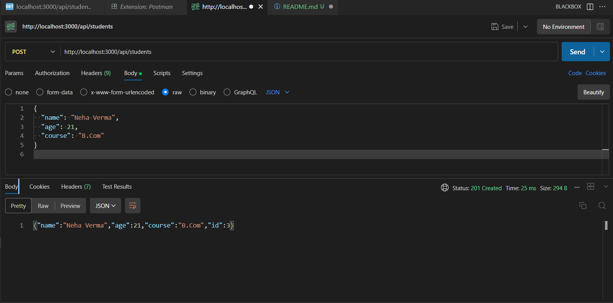

### **Experiment 10 – Express.js Web Application with REST API for CRUD Operations**

Develop an Express web application to perform CRUD (Create, Read, Update, Delete) operations on student data using REST API endpoints. Test the API using Postman.

---

### Project Structure

```
StudentAPIApp/
├── package.json
├── server.js
├── routes/
│   └── students.js
├── models/
│   └── student.js
└── README.md
```

---

### Steps

1. Initialize the Project

Create a new folder and initialize it as a Node.js project.
Install required dependencies — `express` for server, `body-parser` for handling JSON requests, and `nodemon` for automatic reloading during development.

---

2. Create `server.js`

This file initializes the Express application, sets up middleware, and connects route handlers.
It also defines the base URL and starts the server on port 3000.

---

3. Create the Student Model (`models/student.js`)

Defines an in-memory student database (array of objects) and provides methods to:

* Fetch all students
* Get a student by ID
* Add a new student
* Update existing student details
* Delete a student

---

4. Create Routes (`routes/students.js`)

Defines REST API endpoints for CRUD operations:

* `GET` → Retrieve students
* `POST` → Add new student
* `PUT` → Update student
* `DELETE` → Remove student

These routes internally call the model methods to perform actions on the data.

---

5. Run the Server

Start the application using nodemon to automatically reload on file changes.

```bash
npx nodemon server.js
```

* Server runs at: `http://localhost:3000`
* Default homepage: `http://localhost:3000/`

---

6. REST API Endpoints

| Method | Endpoint            | Description                          |
| ------ | ------------------- | ------------------------------------ |
| GET    | `/api/students`     | Get all students                     |
| GET    | `/api/students/:id` | Get student by ID                    |
| POST   | `/api/students`     | Add new student (JSON body required) |
| PUT    | `/api/students/:id` | Update student by ID (JSON body)     |
| DELETE | `/api/students/:id` | Delete student by ID                 |

---

7. Testing with Postman

 GET `/api/students` → Lists all students

   

 POST `/api/students` → Adds a new student

   

 PUT `/api/students/1` → Updates student with ID 1

   

 DELETE `/api/students/2` → Deletes student with ID 2
 
   


A RESTful Express.js web application was successfully developed and tested using Postman to perform CRUD operations on student data.

