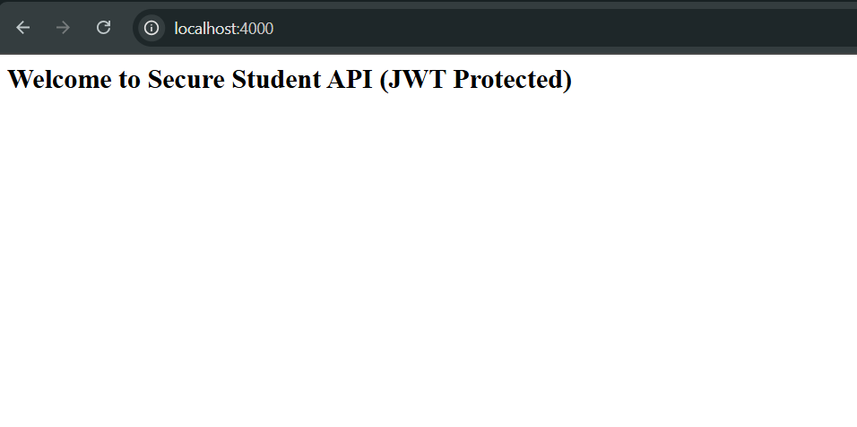
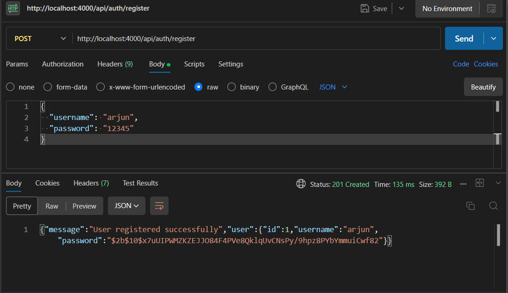
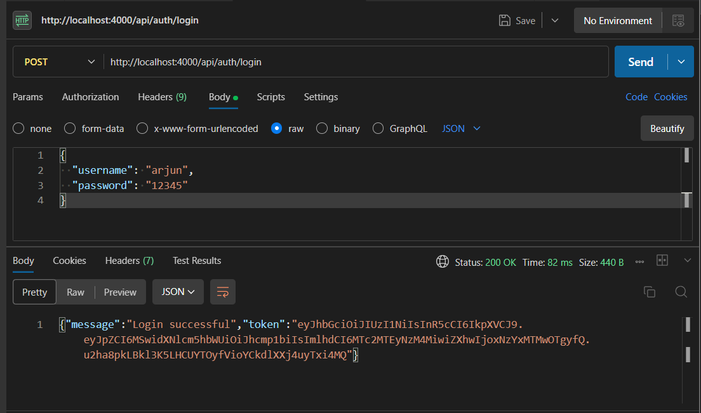
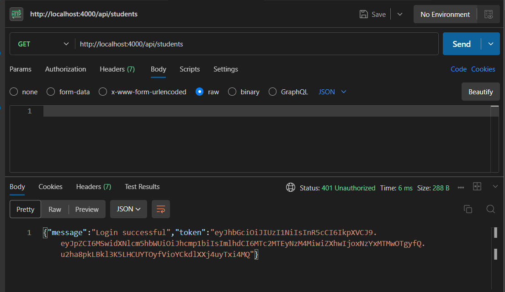

### Experiment 11 – Express.js Web Application with JWT Authentication

Develop an Express.js web application that performs CRUD operations on student data using REST API endpoints with user authentication using JSON Web Token (JWT).

---

### Project Structure

```
StudentAuthAPI/
├── package.json
├── server.js
├── routes/
│   ├── auth.js
│   └── students.js
├── models/
│   ├── student.js
│   └── user.js
└── middleware/
    └── authMiddleware.js
```

---

### Steps

1. Create a new StudentAuthAPI and initialize npm.

   ```
   cd StudentAuthAPI
   npm init -y
   ```
2. Install the required dependencies.

   ```
   npm install express body-parser jsonwebtoken bcryptjs nodemon
   ```
3. Create server.js
   This file initializes the Express server, imports middleware, and defines the base routes for authentication and student operations.
4. Create user model (models/user.js)
   This file defines a simple user object that stores username and hashed password. It includes functions for registering new users and verifying login credentials using bcrypt.
5. Create student model (models/student.js)
   This file manages an in-memory array of student data. It provides helper methods for adding, updating, retrieving, and deleting student records.
6. Create authentication middleware (middleware/authMiddleware.js)
   This file checks for a valid JWT token in the request headers. It allows access to protected routes only when a valid token is provided.
7. Create authentication routes (routes/auth.js)
   This file defines endpoints for user registration and login. On successful login, it generates a JWT token that can be used for accessing protected routes.
8. Create student routes (routes/students.js)
   This file defines CRUD endpoints for student data. All routes are protected and can only be accessed with a valid JWT token.
9. Run the server

   ```
   npx nodemon server.js
   ```

   Server runs at [http://localhost:4000](http://localhost:4000)

   
    


---

### REST API Endpoints

Authentication Routes:

| Method | Endpoint           | Description                  |
| ------ | ------------------ | ---------------------------- |
| POST   | /api/auth/register | Register a new user          |
| POST   | /api/auth/login    | Login user and get JWT token |

### Testing with Postman

1. Register a new user
   POST [http://localhost:4000/api/auth/register](http://localhost:4000/api/auth/register)

   
2. Login with the same user
   POST [http://localhost:4000/api/auth/login](http://localhost:4000/api/auth/login)
  
    

   Copy the token received in the response.

3. Access student routes using the token

   Add the following header in Postman:

   Authorization: Bearer <your_token_here>

   Example endpoints:

   * GET [http://localhost:4000/api/students](http://localhost:4000/api/students)
   
    

