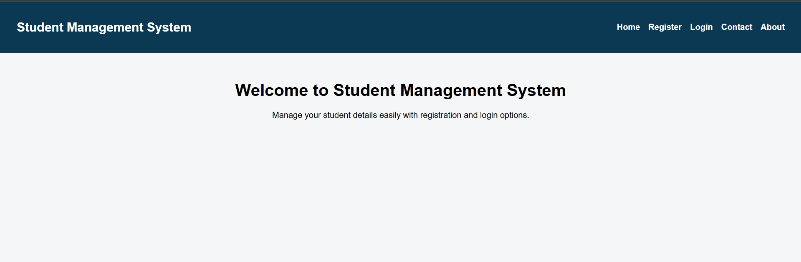
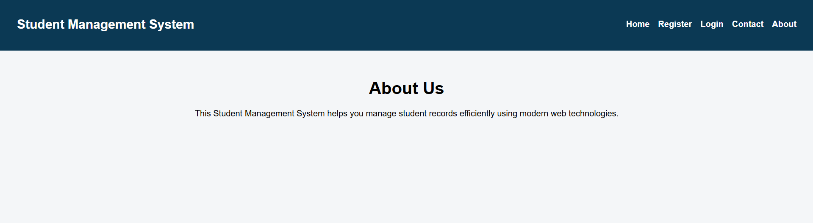
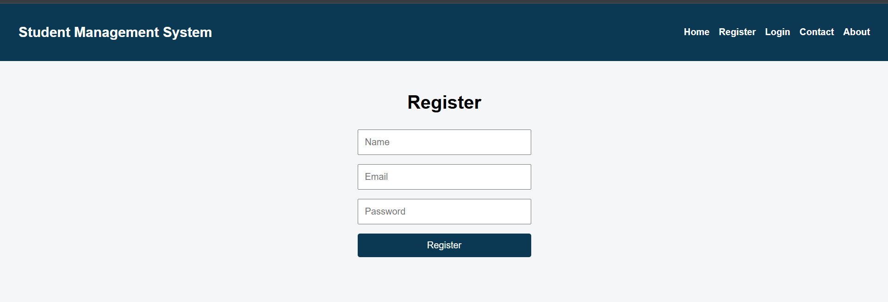
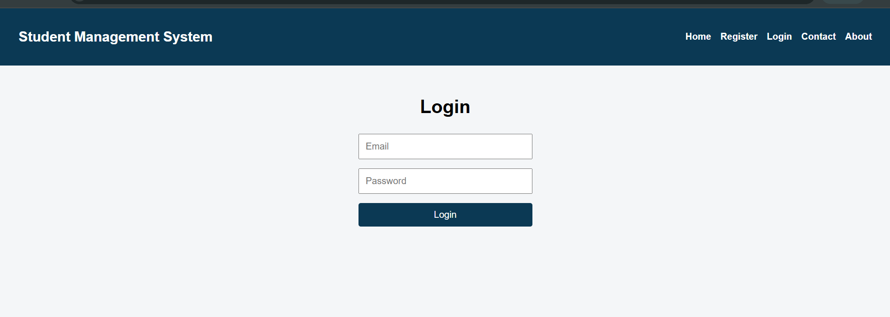

# Experiment 12 – React Student Management System with Routing

Develop a React application for the Student Management System with pages for  `Home` ,  `Register` ,  `Login` ,  `Contact` , and  `About` . Implement `routing` to navigate between these pages.

## Steps

1. Create a new React project using `create-react-app` and install React Router Dom.
2. Set up the `App.js` file with `BrowserRouter`, `Routes`, and `Route` for navigation.
3. Create a `Navbar` component with links to Home, Register, Login, Contact, and About pages.
4. Create individual  `page components` : Home, Register, Login, Contact, and About.
5. Implement `forms` in Register and Login pages with basic state management and form submission alerts.
6. Add basic `styling` in App.css and Navbar.css for layout, colors, and responsive design.
7. Run the React application on `http://localhost:3000` using `npm start`.
   <table>
    <tr>
        <td></td>
        <td></td>
    </tr>
    <tr>
        <td></td>
        <td></td>
    </tr>
</table>

