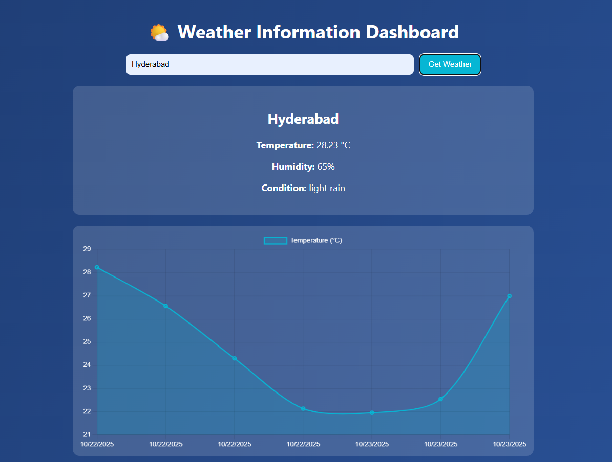
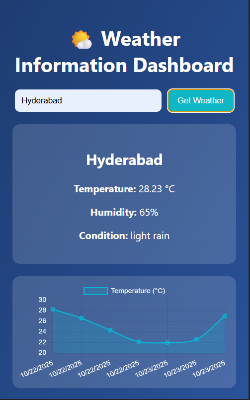

### **Experiment 13 – Weather Dashboard with React and Chart.js**

Create a React application that fetches weather data from OpenWeatherMap API and displays current and historical weather information using Chart.js.

### Steps:

Create a Weather Dashboard project:

Here’s a clean README for your Weather Dashboard React project, focusing on **steps and functionality** rather than code blocks or explanations:

---

# Experiment – Weather Dashboard with React and Chart.js

Create a React application that fetches weather data from OpenWeatherMap API and displays current and historical weather information using Chart.js.

## Project Structure

```
WeatherDashboard/
├── package.json
├── public/
│   └── index.html
├── src/
│   ├── App.js
│   ├── index.js
│   ├── components/
│   │   ├── Header.js
│   │   ├── WeatherCard.js
│   │   └── Chart.js
│   ├── services/
│   │   └── weatherService.js
│   └── styles/
│       └── App.css
└── README.md
```

## Steps

1. Create project folder and initialize React app:

```bash
npx create-react-app WeatherDashboard
cd WeatherDashboard
npm install chart.js react-chartjs-2 axios
```

2. Create a **weather service** (`weatherService.js`) to fetch current and historical weather data from OpenWeatherMap API.

3. Create React components:

   * `Header.js` – displays the app title and search input.
   * `WeatherCard.js` – shows current weather details.
   * `Chart.js` – renders historical weather data using Chart.js.
   * Input field for entering a city name.
   * Section to display current weather.
   * Canvas area for Chart.js line graph.

4. Implement state management in `App.js` to store API data.

5. Handle API requests and errors using Axios.
   * Current weather: `/weather?q={city}&units=metric&appid={API_KEY}`
   * 7-day forecast: `/onecall?lat={lat}&lon={lon}&exclude=current,minutely,hourly,alerts&units=metric&appid={API_KEY}`

6. Display data in components and update charts dynamically based on user input.
   * Plot historical temperature data using Chart.js.
   
   * Use CSS3 and responsive layout to make the dashboard mobile-friendly.
   
7. Run the React app:

```bash
npm start
```

* Application runs at `http://localhost:3000`
* Enter a city name to fetch weather information.


 
