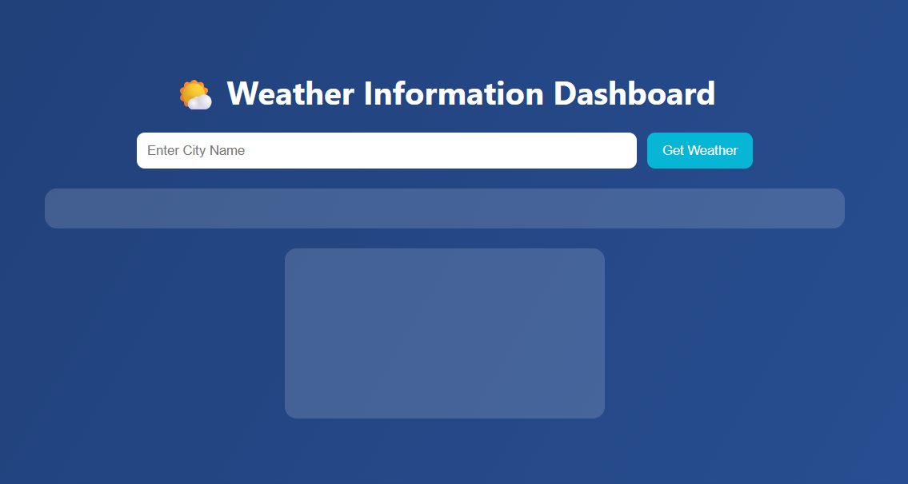
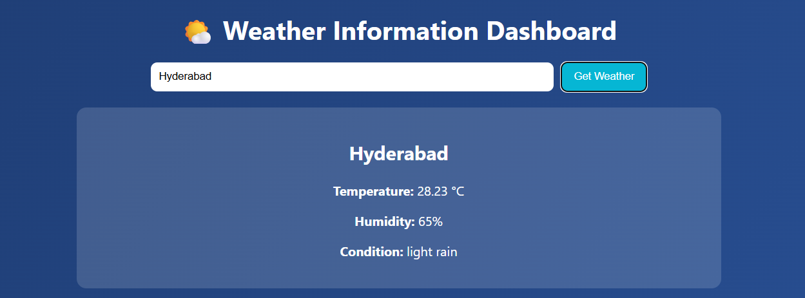

### **Experiment 4 - Weather Information Application Using ES6 and Async/Await**

This experiment is to `explore ES6 features` like `arrow functions`, `callbacks`, `promises`, and `async/await` by implementing an application that `fetches weather information` from the `OpenWeatherMap API` and `displays it on a web page`.
Students will understand how to handle asynchronous operations in JavaScript and dynamically update the webpage with live data.

**Steps**

**1: Navigate into the Project Folder**

* Create a new folder named `WeatherApp`.
* Inside it, create two files:

  * `index.html` for structure
  * `script.js` for JavaScript logic
* Open the project folder in a code editor such as Visual Studio Code.

**2: Setup the Project Structure**

* In `index.html`, include the required structure for the web page.
* Add the following sections:

  * An input field for entering a city name.
  * A button to fetch the weather.
  * A section to display weather details such as temperature, humidity, and condition.
* Link the JavaScript file at the end of the body tag:

```
<script src="script.js"></script>
```

**3: Obtain API Key from OpenWeatherMap**

* Visit [OpenWeatherMap](https://openweathermap.org/) and sign up for a free account.
* After signing in, navigate to the API section and copy your unique `API key`.
* You will use this key in the `script.js` file to make requests to the API.

**4: Write JavaScript to Fetch Weather Data**

* In `script.js`, define a base URL for the API and use your API key.
* Use an `async function` to fetch weather data from the API based on the city entered by the user.
* Use the `fetch()` method and handle the response with `await` to process JSON data.
* Extract and display values like city name, temperature, humidity, and weather condition on the web page.

**5: Implement ES6 Features**

* Use `arrow functions` for cleaner function syntax.
* Use `template literals` for displaying data dynamically on the web page.
* Handle errors gracefully using `try...catch` blocks when the city name is invalid or the network fails.
* Use `const` and `let` appropriately for declaring variables.

**6: Test the Application**

* Open `index.html` in a browser.
* Enter any city name and click the button to fetch data.
* Verify that the weather details appear correctly and update dynamically for different cities.

---
   
   
