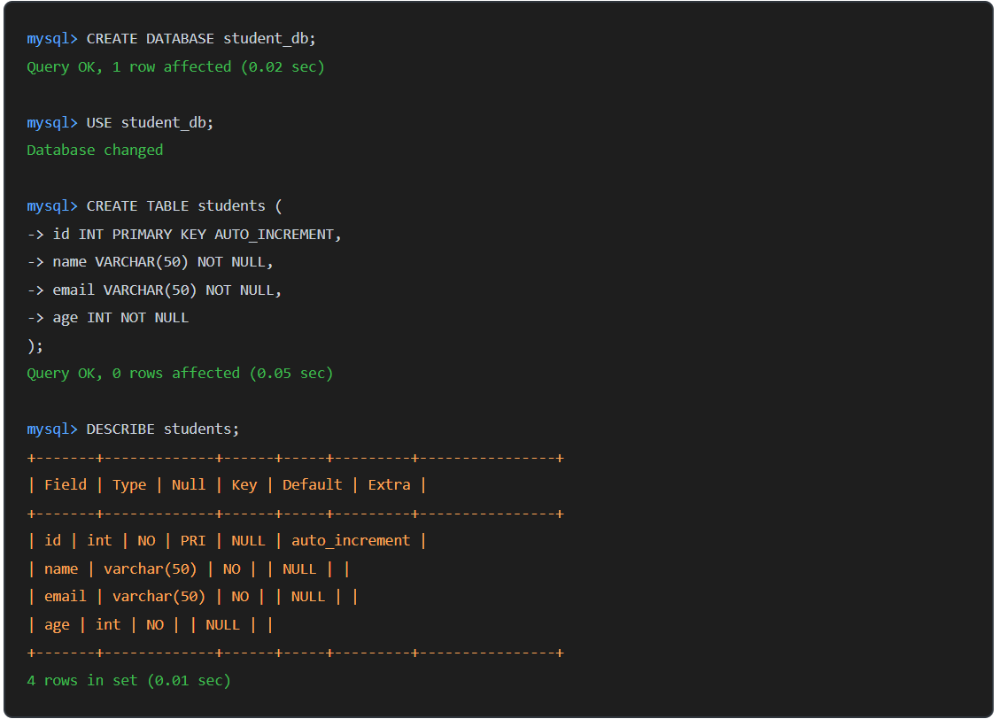
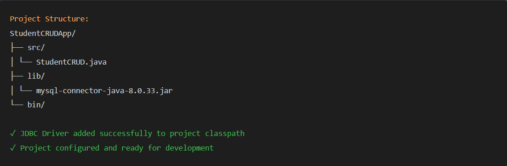
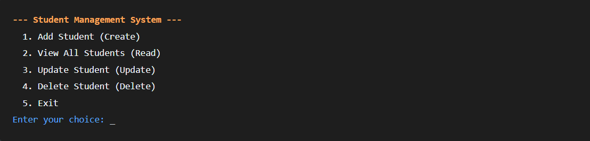
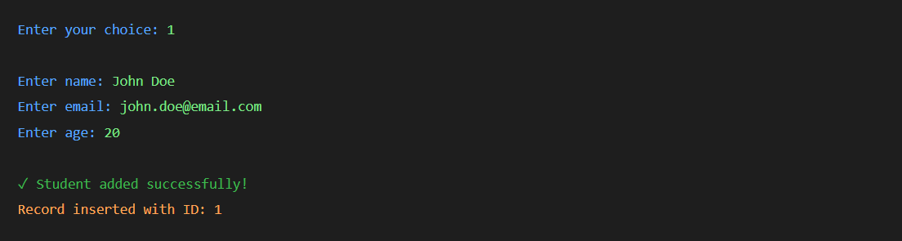
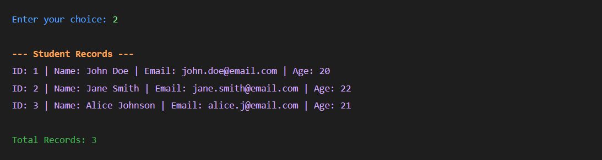
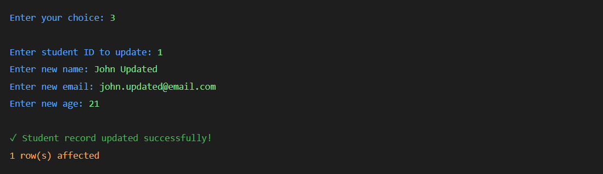
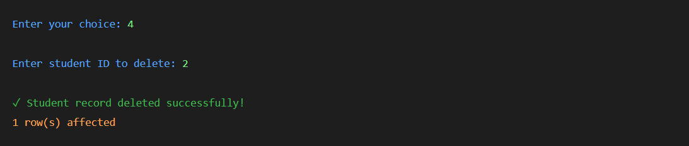
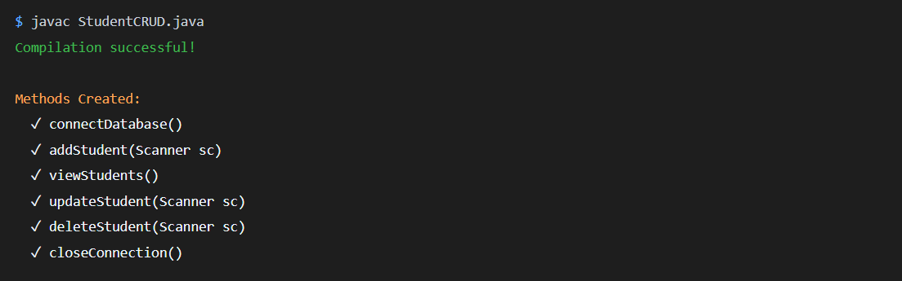

### **Experiment 5 - Java Standalone Application for Database CRUD Operations**

Develop a Java console application that connects to a database and allows the user to manage student records.

### Steps to Perform:

1. Database Setup - Create Database and Table
   Set up MySQL database and create the students table with specified fields (id, name, email, age).

2. Java Project Setup - Add JDBC Driver
   Create a Java project in your IDE and add the MySQL JDBC driver (mysql-connector-java.jar) to the project's classpath.

3. Menu-Driven Application Design
   Design and implement a console menu that provides options for all CRUD operations.

4. Implement CREATE Operation - Add Student
   Use PreparedStatement to safely insert new student records into the database.

5. Implement READ Operation - View Students
   Retrieve and display all student records from the database in a formatted manner.

6. Implement UPDATE Operation - Modify Student
   Update existing student records by ID using PreparedStatement for safe updates.

7. Implement DELETE Operation - Remove Student
   Delete student records by ID with confirmation and success messages.

8. Modular Design - Method Structure
   Create separate methods for each CRUD operation to maintain clean, reusable code.

