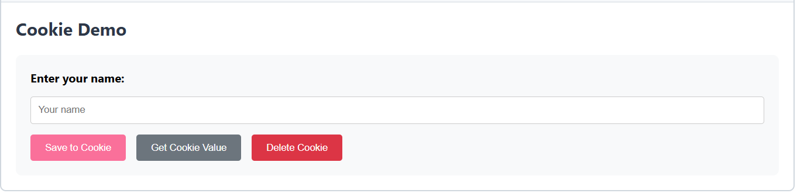
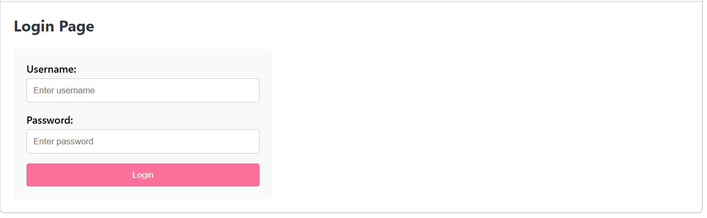
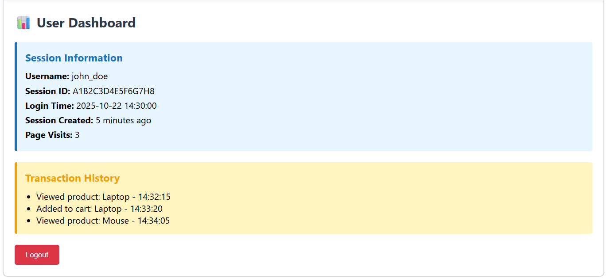
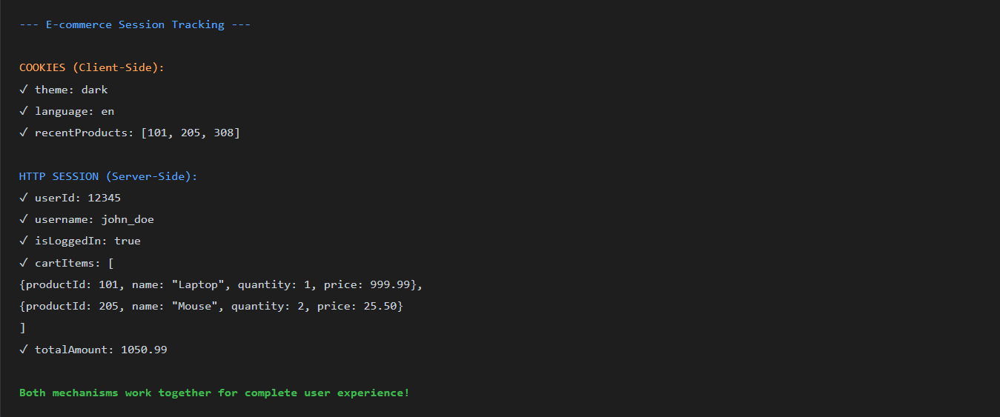

### Experiment 8: Session Tracking Mechanisms

### Steps:

1. Create Project Structure

   Set up a simple web application to demonstrate both Cookies and HTTP Session tracking.

   ```
   SessionTrackingDemo/
   ├── 📁 src/
   │ └── 📁 com/session/servlets/
   │ ├── 📄 CookieServlet.java
   │ ├── 📄 SessionServlet.java
   │ └── 📄 LoginServlet.java
   ├── 📁 WebContent/
   │ ├── 📁 WEB-INF/
   │ │ └── 📄 web.xml
   │ ├── 📄 index.html
   │ ├── 📄 cookieDemo.html
   │ ├── 📄 sessionDemo.html
   │ ├── 📄 login.html
   │ └── 📄 dashboard.jsp
   ```
2. Implement Cookie-Based Tracking

   Create a servlet that stores user preferences using cookies. Cookies are small pieces of data stored in the user's browser.

   
3. Implement HTTP Session Tracking

   Create a servlet that uses HTTP Session to track user login and maintain shopping cart data.

   * Server creates a unique session ID for each user
   * Session ID is stored in a cookie (JSESSIONID)
   * Server maintains session data in memory
   * Session data is accessible across multiple requests
   * Session expires after timeout or when browser closes



4. Display Session Information on Dashboard

   Create a dashboard that displays user information stored in the session and tracks page visits.

```
-- Dashboard Access --- Session found: A1B2C3D4E5F6G7H8
 User authenticated: john_doe
Retrieving session attributes...
username: john_doeloginTime: 2025-10-22 14:30:00pageVisits: 3Updating page visit count: 3 → 4
 Session updated successfully
```





5. Implement Logout (Session Invalidation)

    When user logs out, destroy the session to clear all stored data and end the user's session.

    ```
    --- Logout Request ---
    User: john_doe
    Session ID: A1B2C3D4E5F6G7H8

    Invalidating session...
    ✓ Session invalidated successfully
    ✓ All session attributes cleared
    ✓ Session destroyed

    Redirecting to login page...
    ```
6. Real-World Use Cases Demonstrated

    Both session tracking mechanisms are used together in real applications for different purposes.

    