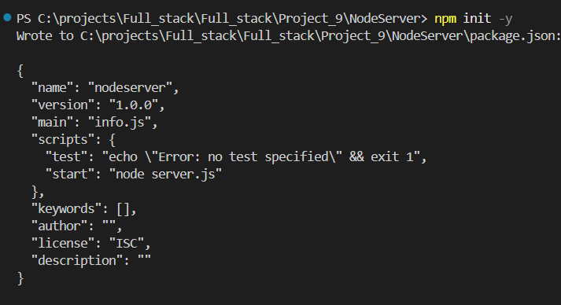
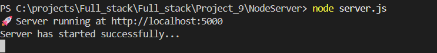
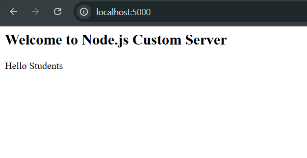
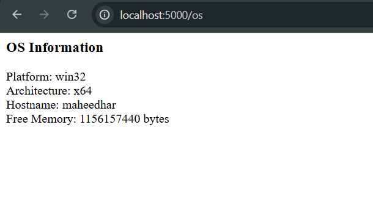
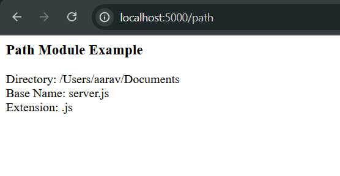
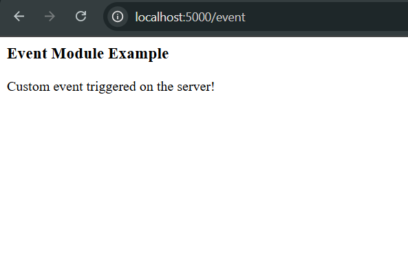

### Experiment 9: Custom Server & Node.js Core Modules

Create a custom server using Node.js `http` module and explore built-in modules like `os`, `path`, and `events`.

### **Steps**

### 1. Create Project Folder

Create a new folder named `NodeServer` and navigate into it:

```bash
mkdir NodeServer
cd NodeServer
npm init -y
```


### 2. Create `server.js`

Inside the `NodeServerDemo` folder, create `server.js` using the **HTTP module** and integrate `os`, `path`, and `events` modules.


   

### 3. Run the Server

```bash
node server.js
```

2. Create server.js with HTTP Module which is inside the folder NodeServer.
3. run the server using `node server.js`



4. Open Browser and Test URLs
Home page displays a welcome message.

* `http://localhost:5000/` - Home page

  
* `http://localhost:5000/os` - OS Module Info
/os shows platform, architecture, hostname, and free memory.

  
* `http://localhost:5000/path` - Path Module Info
/path demonstrates directory, base name, and file extension using Path module.




* `http://localhost:5000/event` - Event Module Example

/event triggers a custom EventEmitter event and logs it in the console.
  

