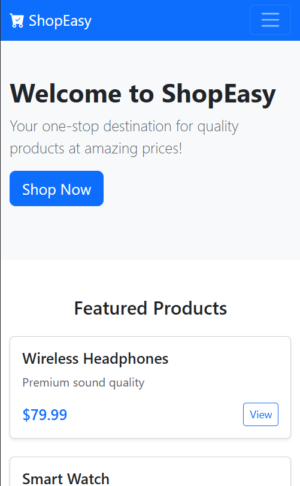
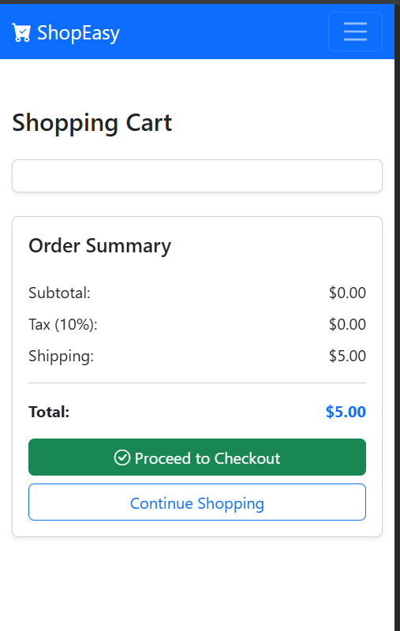
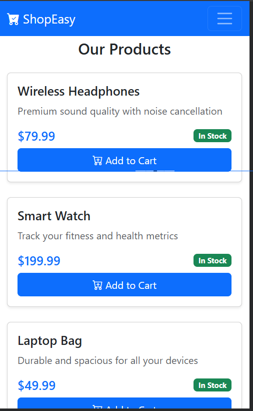

## **Experiment 2 - Responsive Shopping Cart Application Using Bootstrap 5**

 Make the web application responsive using Bootstrap framework.

1. Create project folder: `bootstrap-shopping-cart` Inside it
   create the following subfolders:`css/js/`
2. Set Up Bootstrap 5

* In `index.html`, add the Bootstrap 5 CDN links inside the `<head>` and just before `</body>`:

```html
<!-- Bootstrap CSS -->
<link href="https://cdn.jsdelivr.net/npm/bootstrap@5.3.2/dist/css/bootstrap.min.css" rel="stylesheet">

<!-- Bootstrap Bundle JS -->
<script src="https://cdn.jsdelivr.net/npm/bootstrap@5.3.2/dist/js/bootstrap.bundle.min.js"></script>
```

* You can also add your own `style.css` (if needed) inside `/css` and link it after Bootstrap.

3. Build a Responsive Navigation Bar

Use the Bootstrap Navbar component with:

* Brand logo or text on the left
* Navigation links (Home, Products, Cart)
* Collapsible menu for mobile screens (`navbar-toggler`, `collapse`, `navbar-collapse`)



---

4. Create `products.html` using Bootstrap Grid

Use the Bootstrap Grid System (`row`, `col-12`, `col-sm-6`, `col-md-4`, `col-lg-3`) to create a responsive layout of product cards.

* `row` / `col-*` for grid responsiveness
* `card`, `card-body`, `card-img-top` for structured product display
* `btn`, `btn-primary` for consistent buttons
* `g-4` for grid spacing (gap)

---

5. Create `cart.html` Using Flex & Table Utilities

Use Bootstrap Flex utilities and responsive table/list-group components to display cart items.

* `d-flex`, `justify-content-between`, `align-items-center` for layout alignment
* `list-group`, `list-group-item` for structured item lists
* `btn`, `btn-sm`, `btn-danger` for button styling

---

6. Replace Custom CSS with Bootstrap Utilities

* Spacing: `m-3`, `p-2`, `mt-4`, `mb-5`
* Colors: `bg-dark`, `text-light`, `text-muted`
* Typography: `fw-bold`, `text-center`, `fs-5`
* Buttons: `btn-outline-secondary`, `btn-primary`
* Borders: `border`, `rounded`, `shadow-sm`

This ensures a clean, responsive, and maintainable UI.

7. Test Responsiveness

Check the site across:

* Desktop (≥1200px)
* Tablet (≥768px)
* Mobile (<576px)

Use Chrome DevTools → “Toggle Device Toolbar” to ensure:

* Navbar collapses correctly
* Product cards rearrange gracefully
* Cart layout remains readable on all screens

---

<table>
  <tr>
    <td></td>
    <td></td>
  </tr>
</table>
