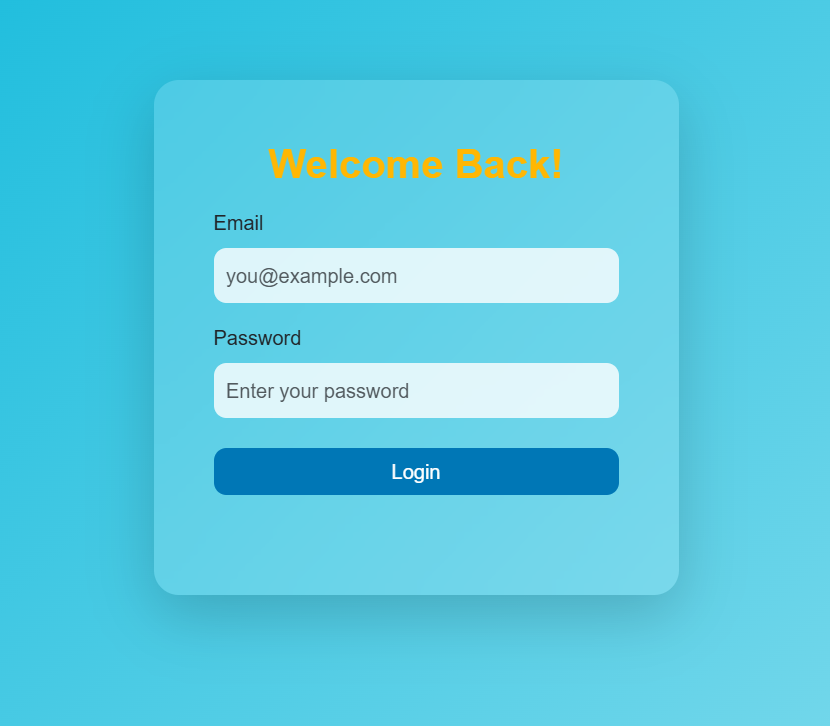
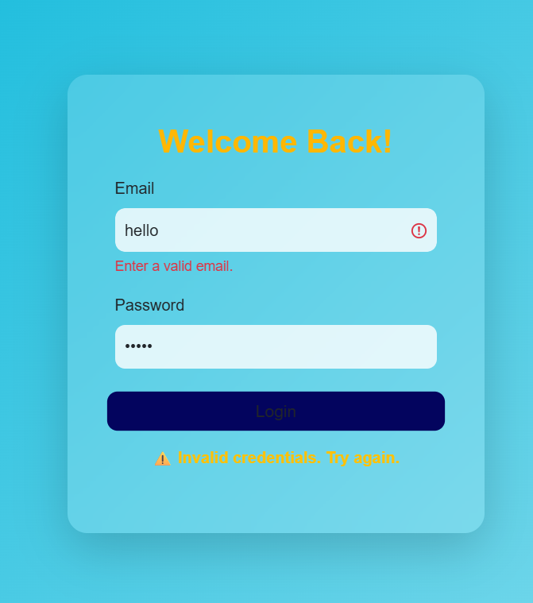

### Experiment 3 - Client-Side Form Validation for Bootstrap-Based Shopping Cart Application

To implement JavaScript-based client-side validation for Registration and Login forms in a responsive shopping cart web application using  Bootstrap 5 validation classes .


### Steps to Perform

1. Open the Bootstrap-based Shopping Cart project created in  Practical 2 .

Project structure should look like this:

```
bootstrap-shopping-cart/
│
├── index.html
├── register.html
├── login.html
├── css/
│   └── style.css
├── js/
│   └── validation.js
└── image/
```

2. Create a New JavaScript File

Inside the `js/` folder, create a new file named: `validation.js`

This file will contain all validation logic for both register and login forms.

3. Add the Registration Form

In `register.html`, design a responsive form using Bootstrap form controls and layout classes.


4. Add the Login Form

In `login.html`, create a simpler version with only email and password fields, using Bootstrap.




5. Link the Script

At the end of both `register.html` and `login.html`, link the validation script before `</body>`:

```html
<script src="js/validation.js"></script>
```

6. Test the Validation

Test your forms by entering:

* Empty fields → should show red borders and messages.
* Invalid email → should display a warning.
* Short password → should highlight the field in red.
* Valid inputs → should show success message and reset the form.

<table>
<tr>
<td>
</td>
<td>
</td>
</tr>
</table>

---
