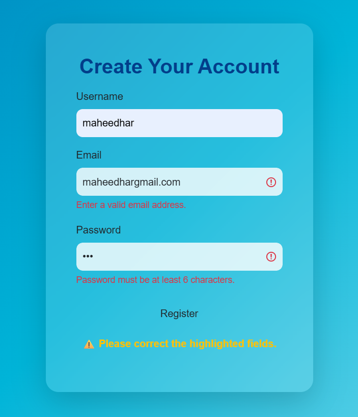

## **Experiment 3 - Client-Side Validation Using JavaScript**

The objective of this experiment is to `implement client-side form validation` for all the pages (registration, login, catalog, and cart) created in `Project 1` and `Project 2`.
Students will learn how to use `JavaScript` to check and validate user inputs before submitting the data to the server, ensuring that only valid and properly formatted information is accepted.

**Steps**

**1: Navigate into the Project Folder**

* Open the existing project folder created in `Project 2`.
* Locate the `HTML` files where user input forms are present (such as registration and login pages).
* Create or open a new JavaScript file named `validation.js` in your project directory.
* Link the JavaScript file to each HTML page using the `<script>` tag placed before the closing `</body>` tag.

**2: Identify Input Fields to Validate**

* Review all the forms in the application and identify the fields that require validation, such as:

  * Name (should not be empty)
  * Email (should follow a valid email format)
  * Password (should meet minimum length requirements)
  * Confirm Password (should match the password field)
  * Phone Number (should contain only digits and be of valid length)

**3: Write Validation Functions**

* Use `JavaScript functions` to perform client-side checks before the form is submitted.
* Use `if` conditions to verify input values and show appropriate error messages.
* Make use of built-in JavaScript methods like:

  * `document.getElementById()` to access form fields
  * `.value` to read user input
  * `.match()` or regular expressions to validate patterns
* Display alerts or inline messages when invalid data is entered.

**4: Add Event Handling for Forms**

* Attach the validation function to the form’s `onsubmit` or `addEventListener('submit', ...)` event.
* If the validation fails, prevent the form from submitting using `event.preventDefault()`.
* Provide clear error messages near the input fields so users can easily correct mistakes.

**5: Validate Specific Forms**

* Registration Page:

  * Check if all required fields are filled.
  * Validate email, password, and confirm password fields.
* Login Page:

  * Ensure both email and password fields are not empty.
* Cart Page:

  * Validate quantity fields to ensure valid numeric values.
* Contact Page (if present):

  * Validate name, email, and message fields for proper input.

**6: Test the Validation**

* Open each form in the browser and enter both correct and incorrect data.
* Verify that the form prevents submission when invalid data is entered.
* Check that all error messages are user-friendly and guide the user to correct input.

---

<table>
<tr>
<td>
</td>
<td>
</td>
</tr>
</table>

---
