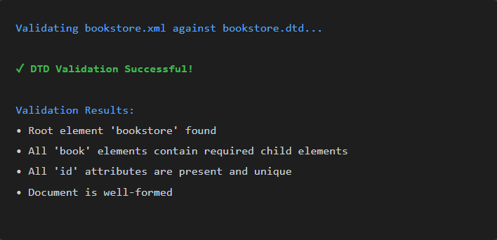

### **Experiment 6 - XML Creation and Validation Using DTD and XSD**

we create an `XML document` for a bookstore, define its structure and data rules, and validate it using both `DTD` (Document Type Definition) and `XSD` (XML Schema Definition)
This experiment helps students understand how XML stores data, how to enforce structure and constraints using DTD and XSD, and how to validate XML files for correctness.

**Prerequisites**

* Basic understanding of XML syntax and structure.
* Code editor such as Visual Studio Code, Notepad++, or any XML editor.
* XML validation tool or browser support to verify XML, DTD, and XSD files.
* [XML Validation Online Tool](https://www.xmlvalidation.com/)
* [Microsoft XML Developer Center](https://learn.microsoft.com/en-us/previous-versions/windows/desktop/ms762271%28v=vs.85%29)
* Familiarity with tags, attributes, and hierarchical data representation.

**Steps**

Setup Project Folder

Open the terminal or command prompt.

Create a new folder named BookstoreXML:

`mkdir BookstoreXML`

Navigate into the folder:

`cd BookstoreXML`
* Inside the folder, create three files:

  * `bookstore.xml` — to define the bookstore data.
  * `bookstore.dtd` — to define the structure and element relationships.
  * `bookstore.xsd` — to define strict data types and constraints.

**2: Create the XML Document**

* Design the `bookstore.xml` file to represent a bookstore.
* Include multiple `book` elements, each containing details such as:

  * `title`
  * `author`
  * `genre`
  * `price`
  * `publish_date`
* Ensure the XML follows a hierarchical structure where `<bookstore>` is the root element and `<book>` is nested within it.

**3: Create the DTD File**

* Define the rules and structure for the XML in `bookstore.dtd`.
* Specify the relationship between elements (e.g., `bookstore` contains multiple `book` elements).
* Define which elements contain text and which have sub-elements.
* Include attributes if required (e.g., `category` for books).

**4: Link DTD to XML**

* Add a `DOCTYPE` declaration at the top of the `bookstore.xml` file to connect it with `bookstore.dtd`.
* Open the XML file in your browser or XML editor and validate it.
* Ensure all tags follow the rules defined in the DTD file.
* Correct any validation errors that appear.

**5: Create the XSD File**

* Define a more detailed and type-specific schema in `bookstore.xsd`.
* Include:

  * Element definitions with data types (string, decimal, date, etc.).
  * Attribute definitions.
  * Cardinality constraints like `minOccurs` and `maxOccurs`.
* Ensure your XSD defines both **structure** and **data validation rules** for the bookstore XML.

**6: Link XSD to XML**

* Add the XML namespace reference for XSD validation in `bookstore.xml`.
* Validate the XML file against the XSD schema using:

  * An XML validation tool,
  * Online XML/XSD validator, or
  * XML plugin available in your IDE.
* Verify that the XML file passes validation successfully.

**7: Verify the Operations**

* Compare the validation process of DTD and XSD:

  * DTD focuses on structure and hierarchy.
  * XSD allows data type enforcement and stricter rules.
* Make observations about the flexibility and precision of each method.
* Note how XSD helps in defining real-world constraints like numeric data, date formats, or string lengths.

