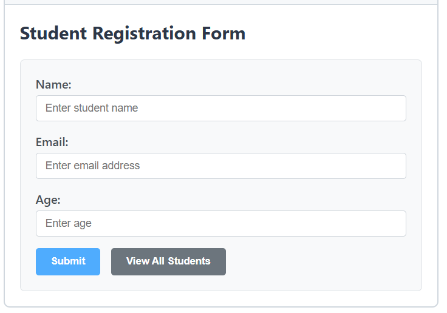
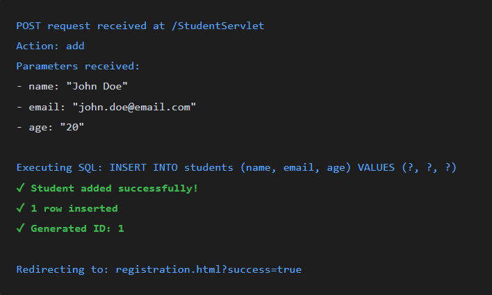
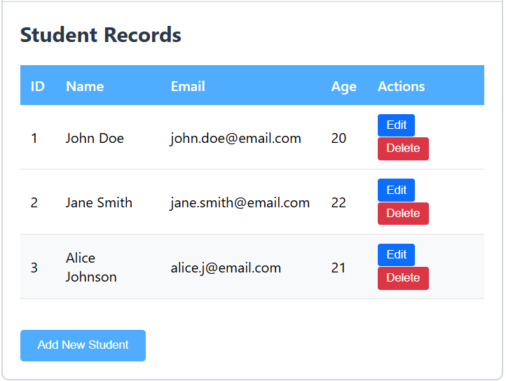
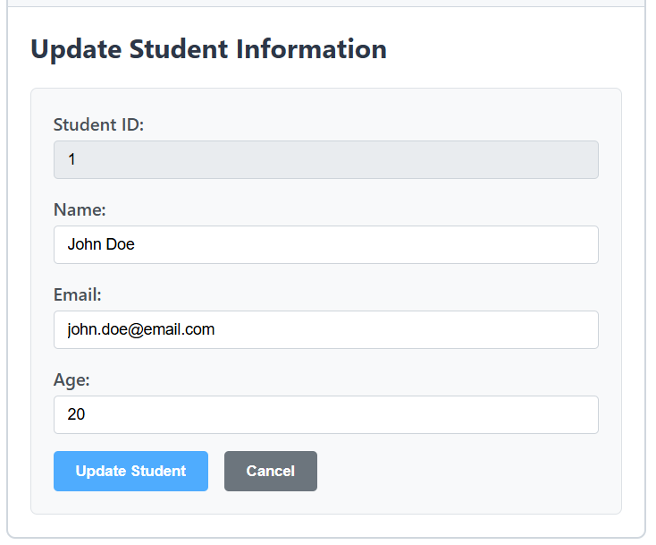

# Experiment 7 -  Servlet Controller Integration

Design a controller with servlet that provides the interaction with application developed in experiment 1 and the database created in experiment 5.

### Steps:

1. Setup Web Application Project Structure
   Create a Dynamic Web Project in Eclipse/IntelliJ with proper directory structure for servlets, HTML pages, and configuration files.

```
StudentWebApp/
├── 📁 src/
│ └── 📁 com/student/controller/
│ └── 📄 StudentServlet.java
├── 📁 WebContent/
│ ├── 📁 WEB-INF/
│ │ ├── 📄 web.xml
│ │ └── 📁 lib/
│ │ └── 📦 mysql-connector-java-8.0.33.jar
│ ├── 📄 registration.html
│ ├── 📄 viewStudents.jsp
│ └── 📄 index.html
└── 📁 build/
└── 📁 classes/

```

2. Configure web.xml Deployment Descriptor
   Set up the web.xml file to map servlets to URLs and configure application settings.

```xml
<?xml version="1.0" encoding="UTF-8"?>
<web-app xmlns="http://xmlns.jcp.org/xml/ns/javaee"
version="4.0">

<!-- Application Display Name -->
<display-name>Student Management System</display-name>

<!-- Welcome File List -->
<welcome-file-list>
<welcome-file>index.html</welcome-file>
</welcome-file-list>

<!-- Servlet Configuration -->
<servlet>
<servlet-name>StudentServlet</servlet-name>
<servlet-class>com.student.controller.StudentServlet</servlet-class>
</servlet>

<!-- Servlet Mapping -->
<servlet-mapping>
<servlet-name>StudentServlet</servlet-name>
<url-pattern>/StudentServlet</url-pattern>
</servlet-mapping>

</web-app>
```

3. Create HTML Registration Form (From Experiment 1)

   Modify the registration form from Experiment 1 to submit data to the servlet controller.



4. Implement StudentServlet Controller

   Create the servlet that handles HTTP requests and communicates with the database.

   ```
   Servlet Methods:
   ├── init() - Initialize database connection
   ├── doGet(HttpServletRequest, HttpServletResponse)
   │ └── Handles: View all students, Delete student
   ├── doPost(HttpServletRequest, HttpServletResponse)
   │ └── Handles: Add student, Update student
   ├── addStudent() - Insert new record
   ├── viewStudents() - Retrieve all records
   ├── updateStudent() - Update existing record
   ├── deleteStudent() - Delete record
   └── destroy() - Close database connection

   ```
5. Test CREATE Operation - Add Student

   Submit the registration form to add a new student to the database.
   
6. Test READ Operation - View All Students

   Click "View All Students" to retrieve and display all records from the database.

   ```sql
   GET request received at /StudentServlet
   Action: view
   Executing SQL: SELECT * FROM students
   ✓ Query executed successfully
   ✓ Records retrieved: 3
   Forwarding to: viewStudents.jsp
   ```
   
7. Test UPDATE Operation - Edit Student
   Click "Edit" button to modify an existing student record.

   
